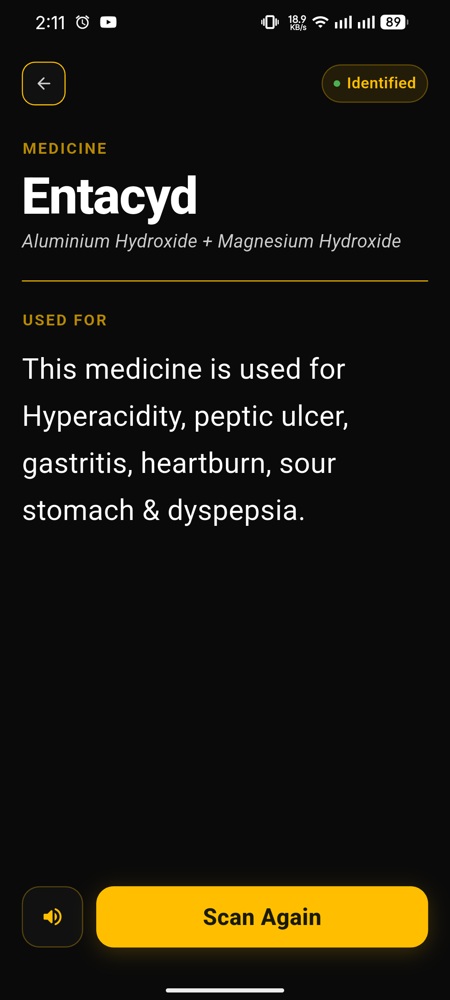
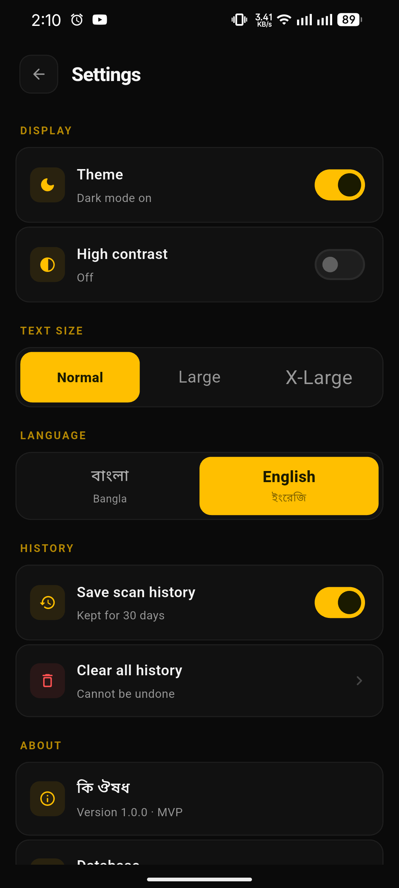
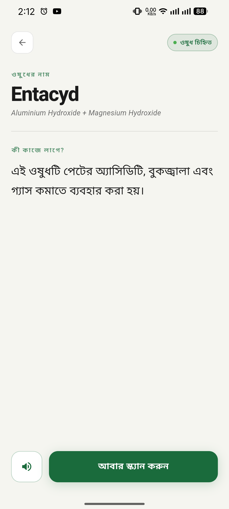
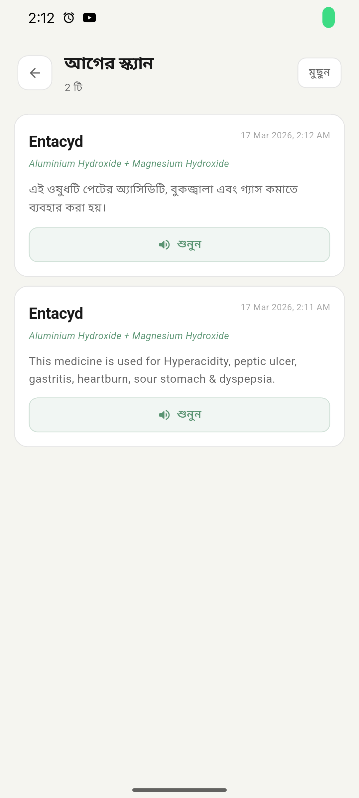
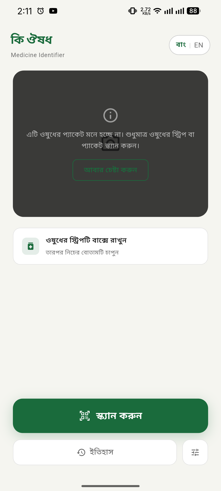

# কি ঔষধ — Ki Oushodh

**An accessible medicine identifier for elderly and low-literacy users in Bangladesh.**

Ki Oushodh (কি ঔষধ — "What medicine?") lets users point their phone camera at any medicine blister pack or box and instantly hear what the medicine is and what it is used for — in Bangla or English.

---

## The Problem

Elderly and low-literacy individuals in Bangladesh routinely struggle to identify their own medicines. Blister pack text is small, pharmaceutical names are complex, and existing apps require typing or reading — skills that create barriers for a large portion of the population.

## The Solution

A frictionless scan-and-speak experience:
1. Open the app
2. Point the camera at a medicine strip
3. Tap once
4. The app speaks the result aloud in Bangla or English

No typing. No reading required. Works on low-end devices with poor internet.

---

## Features

- **Camera OCR** — on-device text recognition via Google ML Kit (no internet needed for scanning)
- **13,929 Bangladeshi medicines** — local database of BD brand names mapped to generic names, sourced from the [Assorted Medicine Dataset of Bangladesh](https://www.kaggle.com/datasets/ahmedshahriarsakib/assorted-medicine-dataset-of-bangladesh)
- **Wikipedia fallback** — for medicines not in the local DB
- **Text-to-Speech** — reads results aloud in Bangla (bn-BD) or English
- **Medicine-only validation** — rejects non-medicine packaging (chips, beverages, etc.)
- **30-day scan history** — saved locally, auto-deleted after 30 days
- **Accessibility settings** — font size (Normal / Large / X-Large), dark/light mode, high contrast
- **Fully offline for BD medicines** — no API key, no cloud dependency for the core feature
- **Low-end device optimised** — 720p capture, single-shot (no streaming), memory-safe

---

## Screenshots

A visual overview of the **Ki Oushodh (কি ঔষধ)** interface, showcasing the high-contrast accessibility features, light/dark modes, and the core user journey.

<p align="center">
  
  
  
</p>

<p align="center">
  
  
  
</p>

<p align="center">
  
</p>

---

## Tech Stack

| Layer | Technology |
|---|---|
| Framework | Flutter (Dart) |
| State management | Riverpod |
| Camera | CameraX via `camera` package |
| OCR | Google ML Kit Text Recognition (Latin) |
| Local database | Hive (NoSQL) |
| Medicine lookup | Local JSON asset (13,929 entries) + Wikipedia REST API |
| Text-to-Speech | flutter_tts (OS native engine) |
| Preferences | shared_preferences |

---

## Architecture

Feature-first (Domain-Driven) with MVVM pattern.

```
lib/
├── core/
│   ├── constants/      # Colors, typography, Bangla translations
│   ├── theme/          # Light/dark/high-contrast themes
│   └── utils/          # Date utils, 30-day cleanup
├── data/
│   ├── local/          # Hive setup
│   └── network/        # HTTP client
├── domain/
│   └── models/         # ScanResult, ScanHistoryModel
├── features/
│   ├── scanner/        # Camera screen + ViewModel
│   ├── results/        # Results screen
│   ├── history/        # 30-day history screen
│   └── settings/       # Accessibility settings
└── services/
    ├── camera_service.dart
    ├── ocr_service.dart
    ├── llm_service.dart    # Local DB + Wikipedia lookup
    ├── tts_service.dart
    └── storage_service.dart
```

---

## Getting Started

### Prerequisites

- Flutter SDK `>=3.3.0`
- Android SDK (minSdk 21)
- A physical Android device (camera required)

### Setup

```bash
git clone https://github.com/meawsin/ki_oushodh.git
cd ki_oushodh
flutter pub get
```

### Add the medicine database assets

Download the JSON assets and place them in `assets/data/`:
- `brand_index.json` — 13,929 brand → generic name mappings
- `medicine_db.json` — generic name → plain English summary

Then register in `pubspec.yaml`:
```yaml
flutter:
  assets:
    - assets/data/brand_index.json
    - assets/data/medicine_db.json
```

### Run

```bash
flutter run
```

### Build release APK

```bash
flutter build apk --release
```

Output: `build/app/outputs/flutter-apk/app-release.apk`

---

## Bangla Text-to-Speech

The app detects whether the device has Bengali TTS installed. If not, it falls back to reading the English summary aloud instead of garbling Unicode text.

**To enable Bangla speech:**
Play Store → Google Text-to-Speech → Settings → Install voice data → Bengali

---

## Data Source

Medicine data sourced from the [Assorted Medicine Dataset of Bangladesh](https://www.kaggle.com/datasets/ahmedshahriarsakib/assorted-medicine-dataset-of-bangladesh) on Kaggle — 21,714 medicines from 220+ Bangladeshi manufacturers.

---

## Scope — Iteration 1 (MVP)

**In scope:**
- Language toggle (Bangla / English)
- Camera capture + on-device OCR
- Medicine identification from local database
- Text-to-Speech result readout
- 30-day scan history
- Accessibility settings (font size, theme, contrast)

**Intentionally excluded (future versions):**
- Dosage/frequency instructions (regulatory liability)
- User accounts or cloud sync
- Barcode/QR scanning
- Multiple language support beyond Bangla and English

---

## License

MIT License — see [LICENSE](LICENSE)

---

## Built With

Built in collaboration with [Claude](https://claude.ai) (Anthropic).