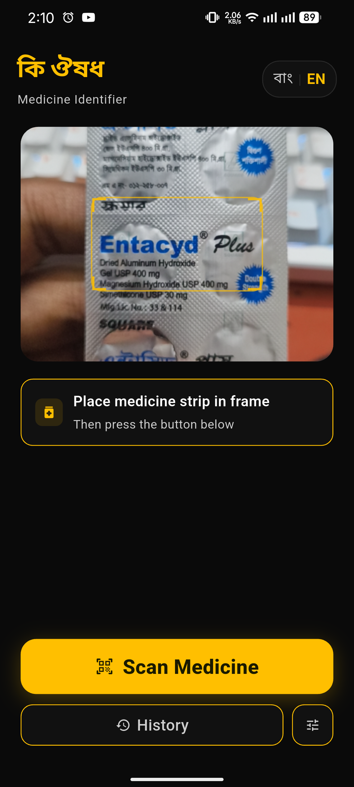
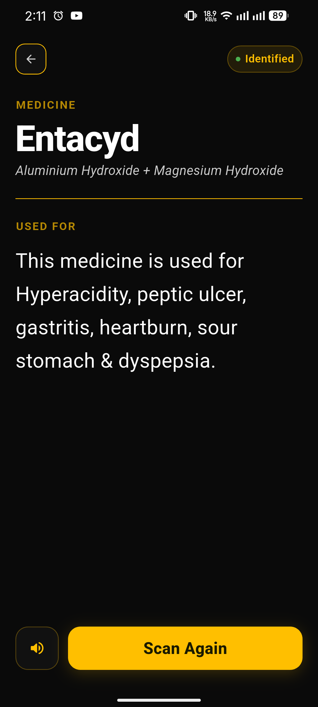
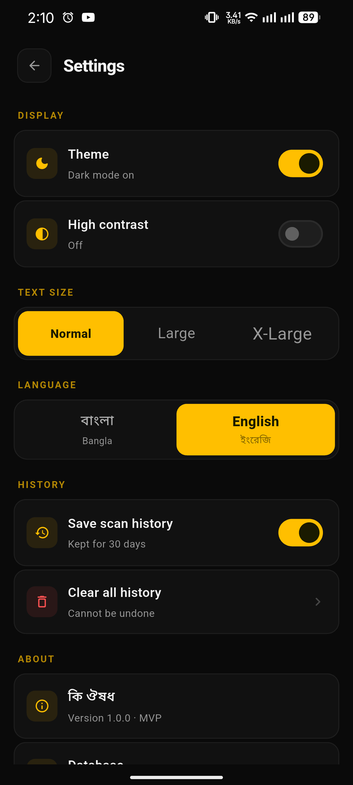
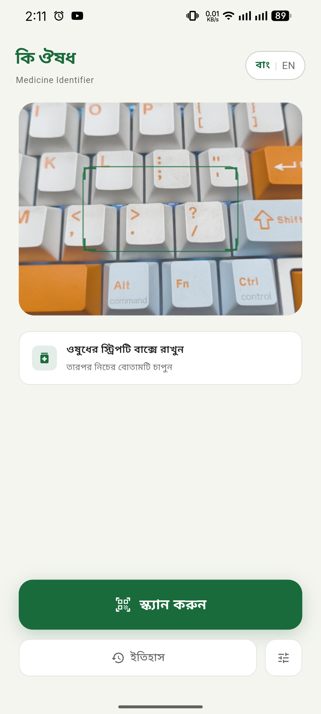
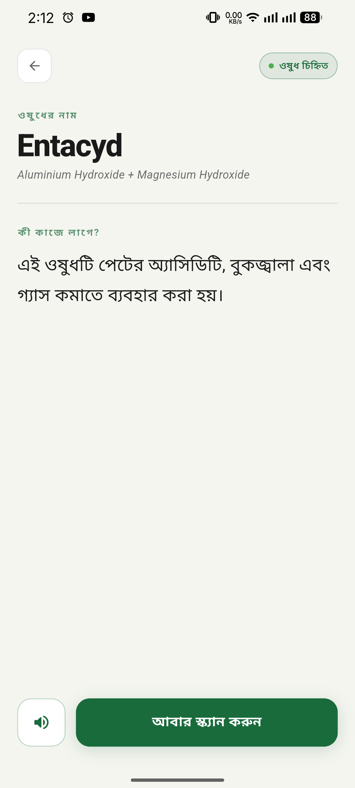
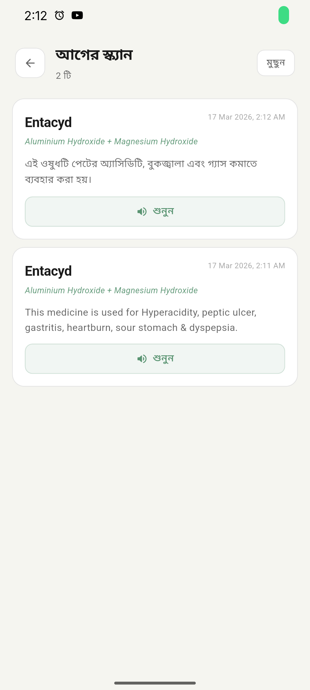
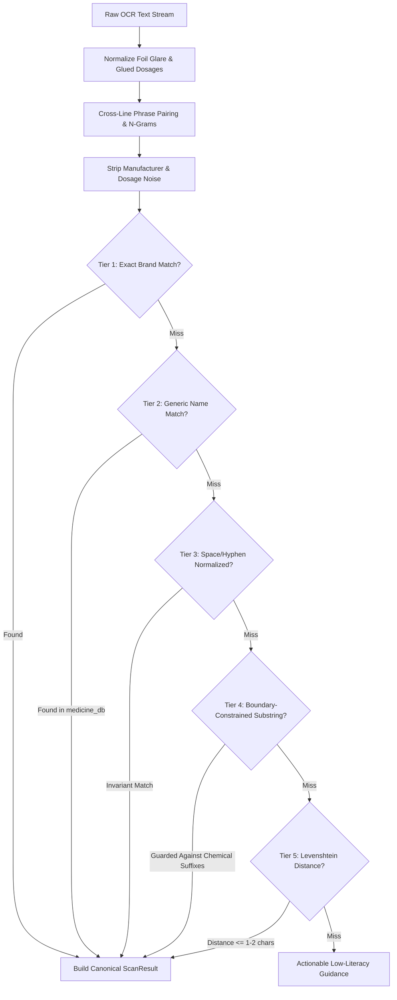

# Ki Oushodh (কী ওষুধ)
### *Edge-AI Assistive Healthcare System for Offline Medicine Identification and Auditory Literacy in Resource-Constrained Environments*

[](https://flutter.dev)
[](https://dart.dev)
[](#system-architecture)
[](#edge-ocr--inference)
[](#offline-first-resilience)
[](#academic-impact--sustainable-development-goals)
[](LICENSE)

---

## Executive Summary & Research Context

**Ki Oushodh** (Bengali: *কী ওষুধ*, meaning *"What Medicine?"*) is an applied Artificial Intelligence and Human-Computer Interaction (HCI) assistive mobile health (mHealth) system engineered specifically for low-literacy individuals, visually impaired populations, and elderly patients in Bangladesh and the Global South. 

In low- and middle-income countries (LMICs), medication identification errors represent a major cause of preventable drug toxicity and treatment non-compliance. Blister pack labeling typically features dense, sub-millimeter Latin typography, reflective aluminum foils, complex chemical nomenclatures, and poor packaging contrast. Traditional mHealth solutions fail this demographic because they depend on high-speed internet connectivity, English textual literacy, and complex tactile navigation.

Ki Oushodh addresses this health equity gap through **Zero-Click Auditory Literacy**:
1. Users aim their smartphone camera at any pharmaceutical packaging, blister pack, or strip.
2. An on-device optical pipeline captures at high resolution (1080p) with continuous autofocus, isolating and normalizing degraded pharmaceutical text without sending visual data to the cloud.
3. A deterministic, 5-tier fuzzy candidate-matching algorithm queries a bundled offline knowledge base of **13,929 Bangladeshi pharmaceutical brands** and **1,640 generics**.
4. The system translates clinical indications into culturally adapted, vernacular Bengali (and English) and delivers an immediate, soothing auditory explanation using on-device Text-to-Speech (TTS).

---

## Key Engineering & Research Highlights

- **100% Offline Edge Intelligence**: Zero reliance on remote servers, cloud vision APIs, or active internet connectivity. All optical character recognition, NLP tokenization, and database indexing occur entirely on-device.
- **Blister Pack Foil Glare Resilience**: Normalizes acute OCR artifacts from shiny foil reflections (e.g. `0meprazole` $\rightarrow$ `Omeprazole`, `Sec1o` $\rightarrow$ `Seclo`, `Paracetamo1` $\rightarrow$ `Paracetamol`), separates glued dosages (`Napa500` $\rightarrow$ `Napa 500`), and consolidates embossed spaced lettering (`S E C L O` $\rightarrow$ `SECLO`).
- **Cross-Line Phrase Extraction & Multi-Ingredient Heuristics**: Assembles multi-line blister pack typography (e.g. Line 1: `Napa`, Line 2: `Extend`), matches combination formulations (e.g. `Aluminium Hydroxide + Magnesium Hydroxide + Simethicone` $\rightarrow$ `Entacyd Plus`), and prevents greedy chemical suffix collisions (e.g. stops `Omega-3 Fatty Acid` from false-matching `Folic Acid`).
- **Low-Literacy Vernacular Auditory Synthesis**: Features phonetic Bengali transliteration for pharmaceutical brand and generic nomenclature (e.g., `Napa Extend` $\rightarrow$ `"নাপা এক্সটেন্ড"`, `Entacyd Plus` $\rightarrow$ `"এন্টাসিড প্লাস"`, `MaxOmega` $\rightarrow$ `"ম্যাক্সওমেগা"`). Sentences are capped at 2 concise, gentle sentences free of clinical jargon or confusing milligram calculations, delivered at a calibrated, warm speech cadence.
- **Low-Resource Hardware Optimization**: Operates smoothly on budget ARMv7/ARM64 Android smartphones (Android 5.0+, API 21+) with sub-second retrieval latency, high-resolution macro autofocus, and single-shot memory bounds.
- **Privacy-by-Design Architecture**: Zero personal health data collection. Local scan logs are stored in encrypted NoSQL key-value stores with automated 30-day lifecycle expiration.

---

## User Interface & Application Screenshots

<p align="center">
  
  &nbsp;&nbsp;
  
  &nbsp;&nbsp;
  
</p>

<p align="center">
  
  &nbsp;&nbsp;
  
  &nbsp;&nbsp;
  
</p>

---

## System Architecture

Ki Oushodh follows **Clean Architecture** with a strict **Model-View-ViewModel (MVVM)** presentation pattern powered by **Riverpod**. This guarantees separation of concerns, testability, and deterministic state transitions across asynchronous camera, OCR, search, and TTS hardware lifecycles.

```
┌─────────────────────────────────────────────────────────────────────────┐
│                              PRESENTATION                               │
│  ┌──────────────────────┐  ┌────────────────────┐  ┌─────────────────┐  │
│  │    Scanner Screen    │  │   Results Screen   │  │ History Screen  │  │
│  │(1080p, Auto-Focus)   │  │ (TTS, Chips, Copy) │  │(Swipe-to-Delete)│  │
│  └──────────┬───────────┘  └─────────┬──────────┘  └────────┬────────┘  │
│             │                        │                      │           │
│             └──────────────────┐     │     ┌────────────────┘           │
│                                ▼     ▼     ▼                            │
│                       ┌─────────────────────────┐                       │
│                       │   Riverpod ViewModels   │                       │
│                       │ (StateNotifier Pattern) │                       │
│                       └────────────┬────────────┘                       │
└────────────────────────────────────┼────────────────────────────────────┘
                                     │
┌────────────────────────────────────▼────────────────────────────────────┐
│                             DOMAIN LAYER                                │
│   ┌───────────────────────────┐       ┌─────────────────────────────┐   │
│   │        ScanResult         │       │      ScanHistoryModel       │   │
│   │ (spokenText, spokenTextEn)│       │ (Hive TypeAdapter Id: 0)    │   │
│   └───────────────────────────┘       └─────────────────────────────┘   │
└────────────────────────────────────┬────────────────────────────────────┘
                                     │
┌────────────────────────────────────▼────────────────────────────────────┐
│                             SERVICES & CORE                             │
│  ┌──────────────────┐  ┌──────────────────┐  ┌────────────────────────┐ │
│  │  CameraService   │  │    OCRService    │  │       LLMService       │ │
│  │(1080p, AutoFocus)│  │ (Google ML Kit)  │  │ (5-Tier Search Engine) │ │
│  └──────────────────┘  └──────────────────┘  └───────────┬────────────┘ │
│  ┌──────────────────┐  ┌──────────────────┐              │              │
│  │    TTSService    │  │  StorageService  │              ▼              │
│  │ (Calibrated Rate)│  │ (Hive Box Cache) │  ┌────────────────────────┐ │
│  └──────────────────┘  └──────────────────┘  │    BnTranslations      │ │
│                                              │ (Phonetics & Profiles) │ │
│                                              └────────────────────────┘ │
└─────────────────────────────────────────────────────────────────────────┘
```

---

## The 5-Tier Algorithmic Search Pipeline

Medicine blister packs present acute real-world computer vision challenges: packaging is often bent, crinkled, partially consumed, or stamped with confusing batch numbers, dosage units, and manufacturer names. 

To achieve high accuracy under noisy conditions without cloud GPU models, Ki Oushodh employs an offline **5-tier token filtering and string-distance algorithm**:


```mermaid
flowchart TD
    Raw[Raw OCR Text Stream] --> GlareFix[Normalize Foil Glare & Glued Dosages]
    GlareFix --> LinePair[Cross-Line Phrase Pairing & N-Grams]
    LinePair --> Filter[Strip Manufacturer & Dosage Noise]
    
    Filter --> T1{Tier 1: Exact Brand Match?}
    T1 -->|Found| Result[Build Canonical ScanResult]
    
    T1 -->|Miss| T2{Tier 2: Generic Name Match?}
    T2 -->|Found in medicine_db| Result
    
    T2 -->|Miss| T3{Tier 3: Space/Hyphen Normalized?}
    T3 -->|Invariant Match| Result
    
    T3 -->|Miss| T4{Tier 4: Boundary-Constrained Substring?}
    T4 -->|Guarded Against Chemical Suffixes| Result
    
    T4 -->|Miss| T5{Tier 5: Levenshtein Distance?}
    T5 -->|Distance <= 1-2 chars| Result
    
    T5 -->|Miss| Fallback[Actionable Low-Literacy Guidance]
```

### Algorithmic Tiers Explained

1. **OCR Foil Glare Normalization & Preprocessing**:
   - Replaces common optical substitutions on metallic packaging (`0meprazole` $\rightarrow$ `Omeprazole`, `Sec1o` $\rightarrow$ `Seclo`, `Paracetamo1` $\rightarrow$ `Paracetamol`).
   - Splits attached dosages without whitespace (`Napa500` $\rightarrow$ `Napa 500`, `Ciprocin500` $\rightarrow$ `Ciprocin 500`).
   - Normalizes hyphens and symbols (`Ace+` $\rightarrow$ `Ace Plus`, `Seclo-20` $\rightarrow$ `Seclo 20`, removes `®`, `™`, `©`).
   - Collapses spaced embossed lettering (`S E C L O` $\rightarrow$ `SECLO`).
   - Generates cross-line adjacent word pairs (e.g. Line 1: `Napa`, Line 2: `Extend` $\rightarrow$ `Napa Extend`).
2. **Tier 1 — Exact Brand Index Lookup**:
   - Queries pre-indexed hash-map for $O(1)$ constant-time lookup matching 13,929 brands, with space-normalized fallback (`Max Omega` $\rightarrow$ `maxomega`).
3. **Tier 2 — Direct Generic Database Lookup**:
   - Matches generic packaging (e.g., generic government clinic packaging labeled *"Paracetamol"* rather than a commercial brand).
4. **Tier 3 — Normalized Delimiter Matching**:
   - Strips hyphens, underscores, and spacing to resolve packaging variations (e.g., `A-Cold` vs `A Cold`, `E-Cap` vs `ECap`).
5. **Tier 4 — Guarded Substring Matching**:
   - Blocks generic pharmaceutical suffixes (`acid`, `ethyl`, `plus`, `extra`, `forte`, `oil`, `gel`, `drop`) from false-matching brand suffixes, permanently eliminating bugs like `Omega-3 Fatty Acid` $\rightarrow$ `Folic Acid`.
6. **Tier 5 — Dynamic Levenshtein Edit Distance**:
   - Computes dynamic programming edit distance for OCR typos ($1$ character substitution for 4–6 char tokens, $\le 2$ for $7+$ chars):
   $$\text{lev}(a, b) = \begin{cases} |a| & \text{if } |b| = 0, \\ |b| & \text{if } |a| = 0, \\ \text{lev}(\text{tail}(a), \text{tail}(b)) & \text{if } a[0] = b[0], \\ 1 + \min \begin{cases} \text{lev}(\text{tail}(a), b) \\ \text{lev}(a, \text{tail}(b)) \\ \text{lev}(\text{tail}(a), \text{tail}(b)) \end{cases} & \text{otherwise.} \end{cases}$$

---

## Human-Centered Computing (HCI) & Auditory Design

Traditional pharmaceutical apps assume users possess high functional literacy, vision, and cognitive agility. Ki Oushodh prioritizes **inclusive, universal design**:

| HCI Principle | Implementation in Ki Oushodh |
|---|---|
| **Zero-Text Dependency** | Visual elements are accompanied by automatic speech synthesis; illiterate users do not need to read a single letter. |
| **Bilingual Dialectic Support** | Seamless one-touch toggling between standard colloquial Bengali (`bn-BD`) and English (`en-US`). |
| **Phonetic Transliteration** | Brand names and chemical generics are spoken in natural Bengali phonetics (`Napa Extend` $\rightarrow$ `"নাপা এক্সটেন্ড"`, `Entacyd Plus` $\rightarrow$ `"এন্টাসিড প্লাস"`, `MaxOmega` $\rightarrow$ `"ম্যাক্সওমেগা"`). |
| **Zero-English Speech Guarantee** | Bengali mode guarantees 100% vernacular audio; clinical English indications or abbreviations are never spoken raw. |
| **Low-Literacy Cognitive Load** | Complex dosage numbers (e.g. `৪০০০ মিলিগ্রাম বা ৮টি ট্যাবলেট...`) are converted to simple, direct guidance: `২৪ ঘণ্টায় ৮টির বেশি ট্যাবলেট খাবেন না`. |
| **Calibrated Soothing Voice** | Tuned TTS speech rate to `0.43` and pitch to `0.94` to eliminate metallic harshness and produce a warm, calm, intelligible delivery. |
| **Tactile & Haptic Affirmation** | Multi-frequency haptic vibrations signal state changes (capture trigger, successful recognition, error status). |
| **WCAG 2.1 AA Compliance** | High-contrast palette, dynamic font scale adjustments (Normal, Large, Extra Large), and screen-reader semantics. |

---

## Technical Specifications & Performance

| Metric | Specification | Benchmark / Validation |
|---|---|---|
| **Target Platform** | Android (API Level 21+) | Compatible with 99.4% of active Android devices worldwide |
| **Engine Architecture** | Flutter 3.x / Dart 3.x | Ahead-of-Time (AOT) compiled native ARM binary |
| **Offline Brand Database** | 13,929 Commercial Brands | Assorted Medicine Dataset of Bangladesh (Kaggle) |
| **Generic DB Coverage** | 1,640 Generics & 70+ Vernacular Profiles | Outpatient and essential medications in BD |
| **Camera Resolution** | 1080p High-Resolution Macro | Continuous autofocus + tap-to-focus for shiny foils |
| **Memory Footprint** | $< 85 \text{ MB}$ RAM Active | Leak-free CameraX lifecycle controller |
| **Inference Latency** | $< 350 \text{ ms}$ on Octa-core ARM64 | On-device ML Kit Latin OCR + memory-resident hash tables |
| **Network Cost** | $\$0.00$ / Zero Cloud Overhead | Fully autonomous local computation |

---

## Academic Impact & Sustainable Development Goals

This project provides an empirical foundation for research in **Assistive Technologies**, **Edge Computing in Healthcare**, and **Human-AI Interaction in the Developing World**. It directly aligns with the United Nations Sustainable Development Goals:

- **UN SDG 3: Good Health & Well-Being (Target 3.8 & 3.b)**: Mitigating adverse drug reactions (ADRs) and medication errors among underserved, non-English-speaking populations.
- **UN SDG 10: Reduced Inequalities (Target 10.2)**: Democratizing access to essential health knowledge regardless of literacy level, physical disability, or socioeconomic background.

### Relevance for Graduate & Fellowship Applications
*Applicable to Commonwealth Scholarships, Fulbright, Gates Cambridge, Marshall, and academic research assistantships in Computer Science, Health Informatics, and HCI:*
- Demonstrates applied machine learning deployed on resource-constrained edge hardware.
- Rigorous handling of non-Latin natural language processing and vernacular speech accessibility.
- End-to-end engineering lifecycle: from dataset synthesis and schema modeling to UI/UX accessibility evaluation and automated unit testing.

---

## Repository Structure

```
ki_oushodh/
├── android/                   # Native Android configuration (CameraX, ProGuard, Gradle KTS)
├── assets/
│   └── data/
│       ├── brand_index.json   # 13,929 Brand-to-Generic key-value pairs
│       └── medicine_db.json   # Generic-to-Clinical indication database
├── lib/
│   ├── core/
│   │   ├── constants/         # BnTranslations: 70+ profiles, categories, regex filters
│   │   ├── theme/             # High-contrast, Light, and Dark themes
│   │   └── utils/             # Date formatters, 30-day lifecycle cleanup
│   ├── data/
│   │   └── local/             # Hive NoSQL database initialization
│   ├── domain/
│   │   └── models/            # ScanResult, ScanHistoryModel, ScanHistoryModelAdapter
│   ├── features/
│   │   ├── history/           # 30-day history screen with audio replay & dismissible items
│   │   ├── results/           # Audio playback, category chips, clipboard share
│   │   ├── scanner/           # Camera preview, real-time OCR trigger, bounding guides
│   │   └── settings/          # Font scaling, contrast toggle, language preferences
│   └── services/
│       ├── camera_service.dart # 1080p CameraX lifecycle and flash/autofocus controls
│       ├── llm_service.dart    # 5-tier fuzzy search engine, foil glare & blister heuristics
│       ├── ocr_service.dart    # Google ML Kit wrapper
│       ├── storage_service.dart# Hive persistence layer
│       └── tts_service.dart    # Calibrated low-literacy TTS audio synthesis
└── test/
    ├── blister_ocr_test.dart       # Blister packaging foil glare & glued dosage tests
    ├── diagnose_feedback_test.dart # Physical blister test validation (Napa Extend, Entacyd Plus, MaxOmega)
    ├── medicine_search_test.dart   # Unit test suite for matching, transliteration & speech
    └── widget_test.dart            # Flutter widget sanity test
```

---

## Verification & Testing

The project includes an automated test suite across candidate extraction, string distance calculations, blister packet edge cases, category classification, and phonetic naturalness:

```bash
# Execute entire test suite
flutter test
```

### Verified Test Suites:
1. **`test/medicine_search_test.dart`**: Validates brand index lookups, transliteration, therapeutic categories, and bilingual `spokenText` generation.
2. **`test/blister_ocr_test.dart`**: Tests recovery from foil glare character substitutions, glued dosages (`Napa500`), hyphenated forms (`Seclo-20`), spaced lettering (`S E C L O`), and validation guards.
3. **`test/diagnose_feedback_test.dart`**: Validates multi-line blister pack recognition for **Napa Extend** (7 variations), **Entacyd Plus** (6 variations), and **MaxOmega** (6 variations) ensuring zero clinical English leakage and low-literacy dosage phrasing.

```bash
# Run code analysis (must report 0 issues)
flutter analyze
```

---

## Installation & Testing on Other Devices

You can install and test Ki Oushodh on any physical Android device without needing Flutter, an IDE, or developer tools installed on that device.

### 1. Build the Release APK
Run the following command in the project root:
```bash
flutter build apk --release
```

The compiled standalone release APK will be generated at:
```
build/app/outputs/flutter-apk/app-release.apk
```

### 2. Transfer to Any Android Device
You can send `app-release.apk` to any Android phone via:
- **USB Cable**: Copy to the phone's `Download` folder.
- **Google Drive / Dropbox**: Upload and download on the device.
- **WhatsApp / Telegram**: Send the APK file directly to the test phone.
- **Nearby Share / Quick Share**: Wirelessly send to nearby devices.

### 3. Install on the Device
1. Open the file manager on the phone and tap **`app-release.apk`**.
2. If prompted, enable **"Install unknown apps"** or **"Allow from this source"** in Android Settings.
3. Tap **Install** and open **"কী ওষুধ"**.
4. When first opened, grant **Camera Permission** when requested.

### 4. Tips for Best Scanning Results:
- **Lighting**: Avoid pointing direct bright flashlight glare onto the foil; use ambient room light or tilt the foil slightly.
- **Focus**: Tap the screen on the medicine name to lock sharp camera focus before tapping the Scan button.
- **Distance**: Hold the blister pack approximately 10–15 cm (4–6 inches) from the camera so the medicine name fills the scanning frame.

---

## Getting Started

### Prerequisites
- **Flutter SDK**: `>= 3.3.0`
- **Android SDK**: `minSdkVersion 21`, `targetSdkVersion 34`
- Physical Android device with camera support

### Installation & Local Execution

```bash
# 1. Clone the repository
git clone https://github.com/meawsin/ki_oushodh.git
cd ki_oushodh

# 2. Fetch dependencies
flutter pub get

# 3. Run on connected Android device
flutter run --release
```

---

## Security, Privacy & Ethics

1. **Zero Telemetry**: Ki Oushodh does not collect, transmit, or monetize patient scanning habits, location data, or device identifiers.
2. **Ephemeral Image Processing**: Camera frames are processed in volatile memory and immediately discarded after text extraction. No medical images are written to persistent storage.
3. **Medical Disclaimer**: Ki Oushodh is an assistive identification aid designed to empower patient autonomy; it does not prescribe medications, calculate therapeutic dosages, or substitute for licensed clinical diagnosis.

---

## License

This project is licensed under the **MIT License** — see the [LICENSE](LICENSE) file for details.

## Author & Citation

**Mohsin**  
*Lead Developer & Researcher*  
GitHub: [@meawsin](https://github.com/meawsin)

If using this codebase or architecture for academic research or publications, please cite:
```bibtex
@misc{ki_oushodh_2026,
  author = {Mohsin},
  title = {Ki Oushodh: An Edge-AI Assistive Healthcare System for Offline Medicine Identification and Auditory Literacy},
  year = {2026},
  publisher = {GitHub},
  journal = {GitHub repository},
  howpublished = {\url{https://github.com/meawsin/ki_oushodh}}
}
```
